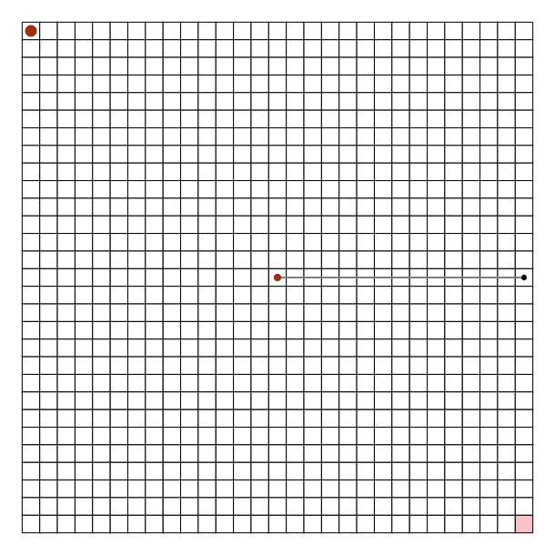
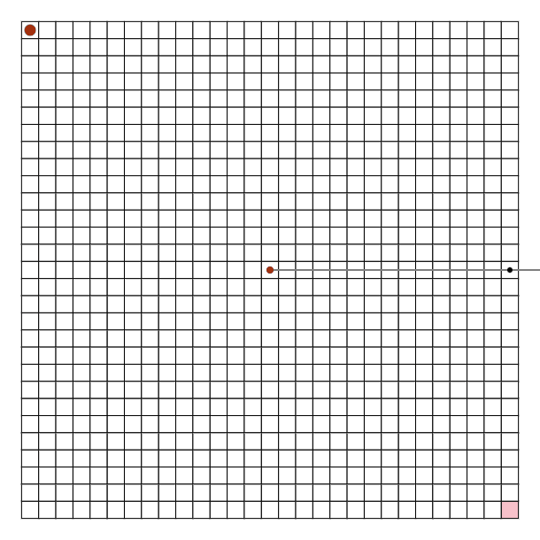

# 提案手法

## 基本的な考え方

現在の状態から最も少ない操作でたこ焼きを掴むまたは離せる操作列を一つ特定しこれを実行する手法をベースとする。ロボットアームの木の深さは 2 とする。
上記に効率を改善するための工夫 1-4 を加えた手法を提案する。

- 工夫 1：選択された操作中に対象のたこ焼き以外のたこ焼きを掴むまたは離せる場合にはそれを実行する
- 工夫 2：頂点を二つ使い頂点から見て斜め方向に指先を配置する
- 工夫 3：多様なロボットアームを作成しそれぞれに対してシュミレーションを行うマルチスタート戦略
- 工夫 4：正方形の外側のたこ焼き及び目的地が優先して選ばれる工夫

## ベースとなる手法

### ロボットアームの設計の観点

深さ 2 の木を作成する。根からの距離が多様な指先を確保するために、距離 1 から n/2 までの距離で指先を配置する。距離 n/2 の指先を配置し終えたら再び距離 1 に指先を配置する。\*n/2 としたのは根を正方形の外に出せない制約に対して全てのマスに到達可能にするためである。

### 操作の観点

全ての指先と目的地のペアに対して回転と移動を考慮して必要な操作回数を計算して、必要な操作回数が最小の操作を実行する。
上記を繰り返す。ここで、目的地は指先がたこ焼きを持っている場合はたこ焼きを配置すべき場所をさし、たこ焼きを持っていない場合にはたこ焼きの場所を指すことと簡単化のため操作回数が最小の操作を一つ選び実行することに注意されたい。

### 探索のイメージ


### ベースとなる手法の改善点

1. 操作する頂点以外が有効に動作していないこと

ベースとなる手法では、以下の場合に必要な操作回数が最小となる指先と目的地のペアに選ばれなかった指先は動作しない。

> 全ての指先と目的地のペアに対して回転と移動を考慮して必要な操作回数を計算して、必要な操作回数が最小の操作を実行する。

例えば以下の場合は最小の動作回数は 1 であるが、片方の動作のみ実行されるため効率が悪くなっている。

イメージについては上記の探索のイメージを確認されたい。

2. 根に対して斜め方向の目的地への対応

深さ 2 の木を設計しているため根に対して斜め方向に指先が存在しない。
例えば、以下のようなたこ焼きの配置の場合、42 回の操作が必要になる。



3. 目的地が偏った問題クラスへの対応

例えば、N=30,M=5 の場合最大距離 5 の指先が設定される。
以下のような例の場合、距離の短い指先しかないために多くの横移動が必要となる


4. 最終盤において、端の目的地が残り多くの移動を必要としている場合への対応

解を観察した際に、最終盤において中心から大きく離れた目的地が残ってしまったため、多くの上下左右の移動を必要としているケースが観察された。 \*コンテスト中には確認いたしました。考察にも一例を示しております。

それぞれ 4 つの改善点に対して、工夫 1-4 で対応する。

## 工夫 1：選択された操作中に対象のたこ焼き以外のたこ焼きを掴むまたは離せる場合にはそれを実行する

選択された"現在の状態から最も少ない操作でたこ焼きを掴むまたは離せる操作列"を実行する間、この操作を実行する指先以外の指先は以下を確認する。

1. 現在指先が配置されている場所でたこ焼きを掴むこと、または掴んでいるたこ焼きを目的地に配置することができるか。
2. 指先を 90 度回転した場所でたこ焼きを掴むこと、または掴んでいるたこ焼きを目的地に配置することができるか。
3. 指先を-90 度回転した場所でたこ焼きを掴むこと、または掴んでいるたこ焼きを目的地に配置することができるか。

上記の確認において、たこ焼きを動かすことができる場合にはこれを実行する。

これにより、選択された"現在の状態から最も少ない操作でたこ焼きを掴むまたは離せる操作列"を実行中に最適とは限らないがベストエフォートでたこ焼きを移動させることができる。

## 工夫 2：頂点を二つ使い頂点から見て斜め方向に指先を配置する

以下の図のように鍵状のアームを設計することで、斜め方向にたこ焼きを移動する際に上下左右の移動数を削減することができる。
ただし、操作の簡単化のため根と指先の間の頂点を支点とした回転はしないことに注意されたい。



## 工夫 3：多様なロボットアームを作成しそれぞれに対してシュミレーションを行うマルチスタート戦略

以下の 7 つのアルゴリズムでロボットアームを作成し、それぞれにおいてシュミレーションする。
シュミレーションの結果、最も操作回数が少なかったロボットアームを採用する。

- miniter

ベース手法と同じ作成方法である。
具体的には、根からの距離が以下の頂をが作成する。
短い長さのアームを優先的に作成する。

```math
[1,2,3,...n/2,1,2...](nは正方形の一辺の長さ,以下略)
```

- miditer

根からの距離が以下の頂点を作成する。
正方形の一辺の長さの 1/4 の程度の長さのアームを優先的に作成する。

```math
[n/4,n/4+1,n/4-1,...n/2,1,n/4,n/4+1,n/4-1,...]
```

- maxiter

根からの距離が以下の頂点を作成する。
正方形の一辺の長さの 1/2 の程度の長さのアームを優先的に作成する。

```math
[n/2,n/2-1,n/2-2,...1,n/2,n/2-1...]
```

- minstep

長さ 1 から 3 刻みでアームを作成する。
具体的には、根からの距離が以下の頂をが作成する。
短い長さのアームを優先的に作成する。

```math
[1,4,7,...n/2,2,5,...]
```

- maxstep

長さ n/2 から 3 刻みでアームを作成する。
具体的には、根からの距離が以下の頂をが作成する。
正方形の一辺の長さの 1/2 の程度の長さのアームを優先的に作成する。

```math
[n/2,n/2-3,n/2-6,...1,n/2-1,n/2-4...]
```

- crossmax

長さ n/2 から 3 刻みでアームを作成する。
ここで、n/4 より長いアームについては深さの 2 の指先と工夫 2 で導入した深さ 3 の指先を交互に作成する。
n/4 より短いアームについては深さの 2 の指先のみを作成する。

```math
[n/2,n/2-3(鍵状),n/2-6,...1,n/2-1(鍵状),n/2-4,...]
```

- crossmid

根からの距離が以下の頂点を作成する。

```math
[n/4,n/4+3(鍵状),n/4-3,...1,n/4+1...]
```

## 工夫 4：正方形の外側のたこ焼き及び目的地が優先して選ばれる工夫

正方形の中心から遠い箇所を優先的に選択するように、たこ焼きを掴むまたは離せる操作列を特定する際に以下の評価関数を使用する。
ただし、$`s`$は評価値であり評価値が最小の操作列を採用、$`p`$はユーザパラメータ、$`c_{ops}`$は操作回数、$`(x,y)`$は目的地の座標である。
$`(x,y)`$が正方形の中心から離れているほど評価が良くなるように設計している。

ユーザパラメータ集合$P$は$`\{1000,n/10,n/5,n/3,n/2\}`$であり、1000 の場合には操作回数$`c_{ops}`$が同じ場合に外側の目的地が選択される。
$`p`$が大きいほど操作列が評価値を支配するようになる。

```math
s = p\cdot c_{ops} -|x - n / 2| - |y - n / 2|
```

## 全体の流れ

提案手法の全体の流れを以下に示す。
ただし、$`A=\{miniter,miditer,maxiter,minstep,maxstep,crossmax,crossmid\}`$は工夫 3 で示した初期化方法の集合、$`P`$は工夫 4 で示したユーザパラメータ集合である。

1. 直積$`A\times P$の各要素$(a,p)`$対して、手順 2-5 を実行する。
2. $`a`$に従ってロボットアームを初期化する。(工夫 2,3)
3. 全ての指先と目的地のペアに対して回転と移動を考慮して必要な操作回数及び工夫 4 で示した評価値をパラメータ$`p`$を用いて計算し、評価値が最小の操作列を獲得する。（工夫 4）
4. 操作列に従ってロボットアームを動かす。この時、操作列で指定していない指先において工夫 1 に従ってたこ焼きを動かす。（工夫 1）
5. 全てのたこ焼きの移動が完了していない場合には、3 に戻る。
