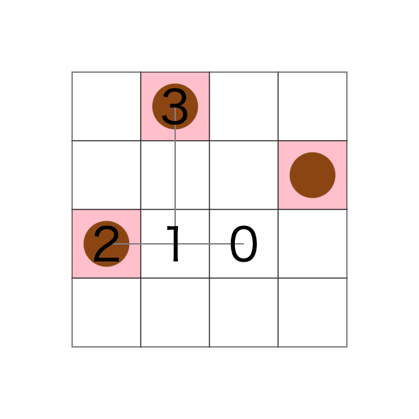
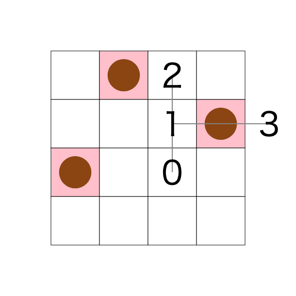
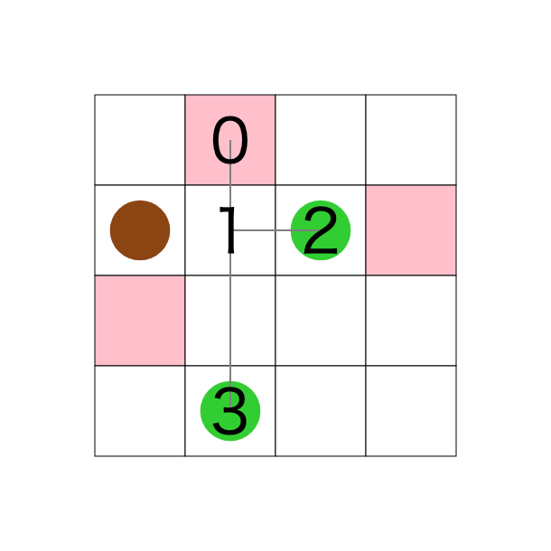
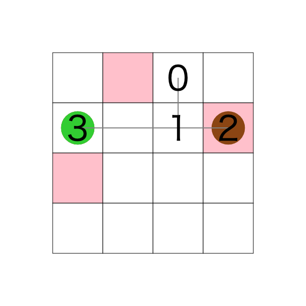

# 問題概要

## 背景

現在、たこ焼きを移動させるロボットアームの開発をしている。 正方形とマス目で表現されたたこ焼き器上のいくつかのマスにたこ焼きが置かれている。 ロボットアームを用いて、これらのたこ焼きを指定されたマスへ移動させたい。

**移動の例:丸がたこ焼き(通常時は茶色、移動時には緑色),赤の四角がたこ焼きの目的地**

## ゴール

- 全てのたこ焼きを目的地に移動させる
- 操作回数を最小化する

### ゴールを達成するために最適化するもの

- ロボットアームの形状
- 操作方法
  - ロボットアームをどう移動、回転させるか。いつたこ焼きを掴み、離すか。

詳細は後述いたします。

## ロボットアームとは

ロボットアームは"関節"と"指先"を頂点とした以下のような構造で表現される。
以下の図のおいては、頂点に数字が振られている。

### 関節とは

関節は、関節か指先を支配下に置く頂点である。
上の図では 0,1 が関節である。
数字の小さい順に確認すると、0 は 1(関節)を支配下に持ち、1 は,2,3(指先)を支配下に持つことがわかる。

関節は支配下の頂点を自分を中心に時計回りまたは半時計周りに 90 度回転させることができる。
以下に頂点 0 を中心に頂点 1 を時計回りに回転させた例を示す。

\*一方で、たこ焼きをつかむことは出来ない

### 指先とは

指先とは支配下の頂点を持たない頂点である。
上の図においては、2,3 が指先である。
指先が配置された場所にたこ焼きがある場合には掴み、たこ焼きを掴んでいる場合には離すことができる。

### 設計可能な要素

- 頂点と頂点の間の長さ
  - 例の場合
    - 0-1 間の長さは 1
    - 1-2 間の長さは 1
    - 1-3 間の長さは 2
  - イメージ：長くするほど遠くのたこ焼きを動かずに取れるが、近くのたこ焼きを取るために動く必要がある
- 各頂点の支配下に置く頂点の数
  - 例の場合
    - 0 の配下の頂点は 1 つ
    - 1 の配下の頂点は 2 つ
    - 2,3 の配下の頂点は 0 個

## 操作の詳細

"1 回の操作"でできることは以下の 3 つである。

1. ロボットアーム全体を上下左右に 1 マス動かす。
2. それぞれの関節を軸に 90 度回転させる。
3. それぞれの指先でたこ焼きを掴む、離す。

### 具体例

以下の例では、以下の 3 つの動作を同時に行っている。

1. ロボットアーム全体を右に 1 マス動かす。
2. 1 の関節を軸に 3 を時計回りに 90 度回転させる。
3. 2 の指先で持っていたたこ焼きを離す。

\*この操作を行った場合に加算される操作回数は一回であるため、操作を並列に行うことで効率が上がることをイメージされたい。

**before**

**after**

## 実行条件

- アルゴリズムの観点
  - たこ焼き機の正方形の一辺の長さ
  - ロボットアームの頂点数の最大値
  - 頂点 0 は正方形の外に出てはいけない
- リソース観点
  - 実行時間は 3 秒以内
  - 利用可能なメモリは 1GiB
