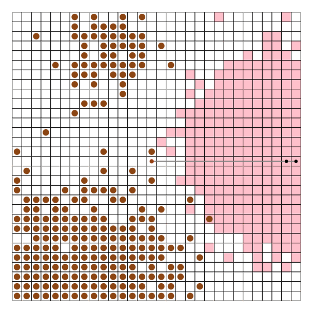

# 評価

提案手法と提案手法から工夫を取り除いた手法の操作回数を比較することで、適用した工夫の有効性を評価する。
また、最も工夫が有効に働いたテストデータでの各手法の挙動を確認することで、工夫が期待通りの効果をもたらしているかを確認する。

## 実験条件

テストデータセット：Web 版ビジュアライザのデフォルト設定(seed 0,サイズ 100,N 及び M についての指定なし)

## 比較手法

提案手法と提案手法から各工夫を取り除いた手法(例：提案手法 w/o 工夫 1)、ベース手法を 100 個のテストデータでの操作回数の和観点で比較する。
ただし、工夫 3 については取り除いた際に工夫 2 も同時に取り除かれる点に注意されたい。

## 考察

### 操作回数の比較

提案手法と提案手法から各工夫を取り除いた手法、ベース手法を 100 個のテストデータでの操作回数の和及び、工夫を取り除くことで提案手法より操作回数が増えたテストデータの数を以下に示す。
工夫 1,3 が大きく操作回数を削減していることを確認できた。

| 手法                                        | 操作回数の和 | 工夫を取り除くことで提案手法より 操作回数が増えたテストデータの数 |
| ------------------------------------------- | -----------: | -------------------------------------------------------------------: |
| 提案手法                                    |        17996 |                                                                    - |
| 提案手法 w/o 工夫 1                         |        33217 |                                                              100/100 |
| 提案手法 w/o 工夫 2                         |        18123 |                                                               18/100 |
| 提案手法 w/o 工夫 2,3                       |        29948 |                                                               94/100 |
| 提案手法 w/o 工夫 4                         |        20076 |                                                               90/100 |
| ベース手法 （提案手法 w/o 工夫 1,2,3,4） |        47965 |                                                              100/100 |

### 工夫により改善されたテストデータでの挙動の観察

工夫の有無により最も差分の大きかったテストデータを観察し、工夫が有効に働いているか観察する。

#### 工夫 1

提案手法 w/o 工夫 1 の操作回数は 681 回であり、提案手法の操作回数は 234 回であった。
提案手法 w/o 工夫 1 では指を一つずつしか利用できておらず、非効率になっていることが確認できた。

**63 番目のデータにおける提案手法 w/o 工夫 1 の操作の様子**

**63 番目のデータにおける提案手法の操作の様子**

#### 工夫 2

提案手法 w/o 工夫 2 の操作回数は 182 回であり、提案手法の操作回数は 149 回であった。
提案手法 w/o 工夫 2 においては根が正方形の中心から遠い位置に移動することが多く見受けられた。これが提案手法により削減されたため操作回数が減ったように見受けられた。

**14 番目のデータにおける提案手法 w/o 工夫 2 の操作の様子**

**14 番目のデータにおける提案手法の操作の様子**

#### 工夫 3

提案手法 w/o 工夫 2,3 の操作回数は 2543 回であり、提案手法の操作回数は 620 回であった。
提案手法 w/o 工夫 2,3 においては正方形の大きさに対してロボットアームの頂点数が少ない場合、正方形の端のたこ焼きと対面の端に回転で移動させることはできないため、上下左右の移動を多用していた。提案手法においては、多様な長さのアームを用いることができるので、探索効率が改善したことを確認できた。

**57 番目のデータにおける提案手法 w/o 工夫 2,3 の操作の様子**

**57 番目のデータにおける提案手法の操作の様子**

#### 工夫 4

提案手法 w/o 工夫 4 の操作回数は 496 回であり、提案手法の操作回数は 406 回であった。
提案手法 w/o 工夫 4 においては正方形の中心付近からたこ焼きが埋められていくことを確認できた。提案手法については、こちらの傾向がなくなったことを確認できた。

**8 番目のデータにおける提案手法 w/o 工夫 4 の操作の様子**

**8 番目のデータにおける提案手法の操作の様子**

#### 補足

工夫 2,4 については操作回数の改善はあったものの、改善幅は少なかった。考察から一定の効果は確認できたものの、工夫の導入によって初期化状態を変えたマルチスタートの回数が増えたため微小に操作回数が改善した可能性がある。

## 今後の課題

- マルチスタート手法におけるより良い初期化条件の提案

  工夫 2,4 については操作回数の改善はあったものの、改善幅は少なかった。考察から一定の効果は確認できたものの、工夫の導入によって初期化状態を変えたマルチスタートの回数が増えたため微小に操作回数が改善した可能性がある。より良い初期化状態を与えることで操作回数の削減が期待できると考える。

- 斜め方向のアームの関節を固定しない

操作の簡単化のために固定したが、固定しないことでより効率が上げることができる。

- ビームサーチの導入
- 回転回数の削減

  現在の手法ではたこ焼きが回転先にない場合においても探索領域を広げるために、とりあえず回転させている。一方で、実世界に実装する観点においては無駄な回転は故障の原因となるため削減するべきである。
